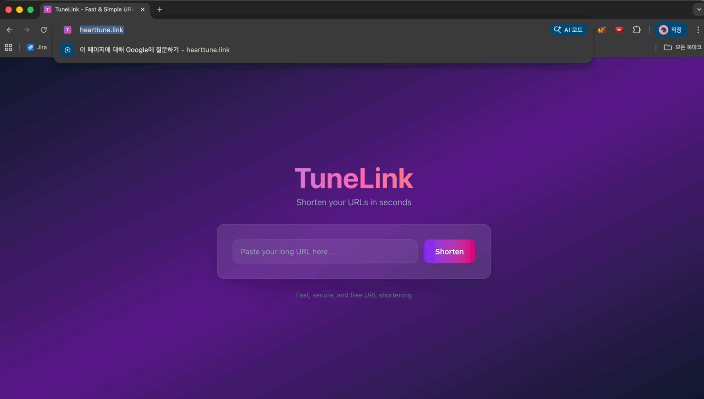
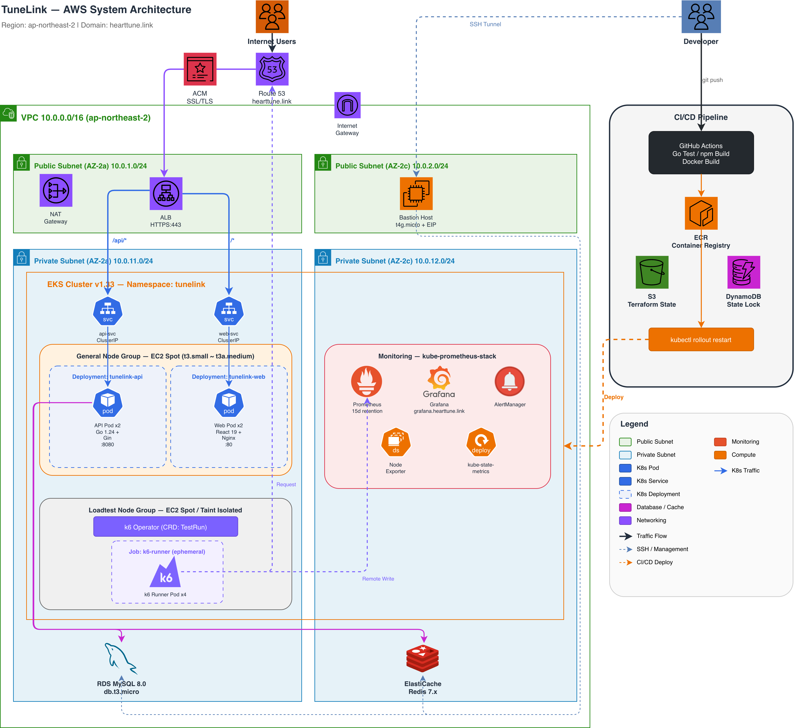
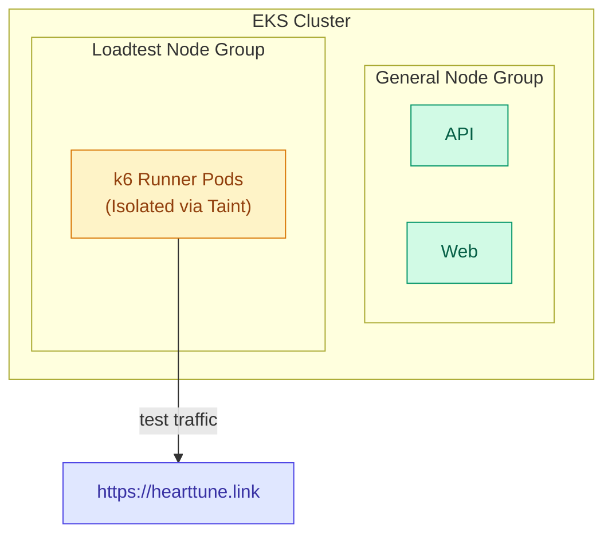
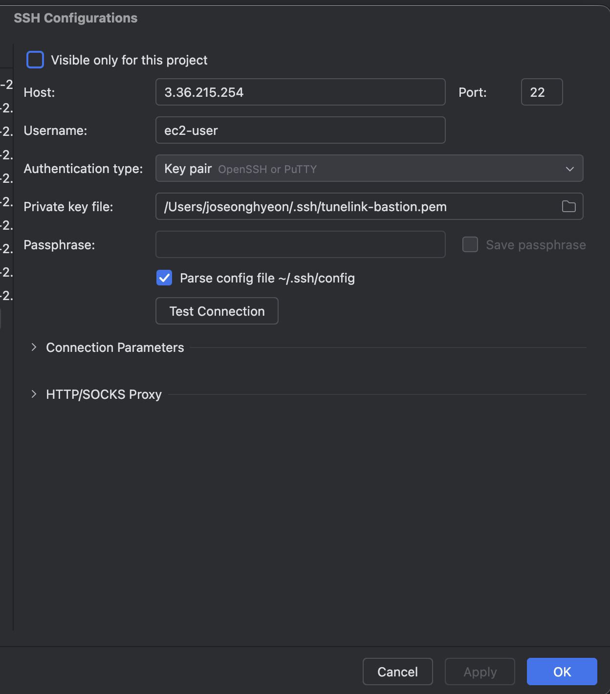
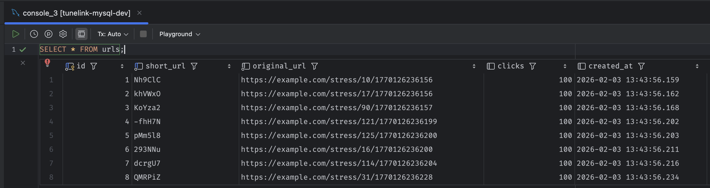
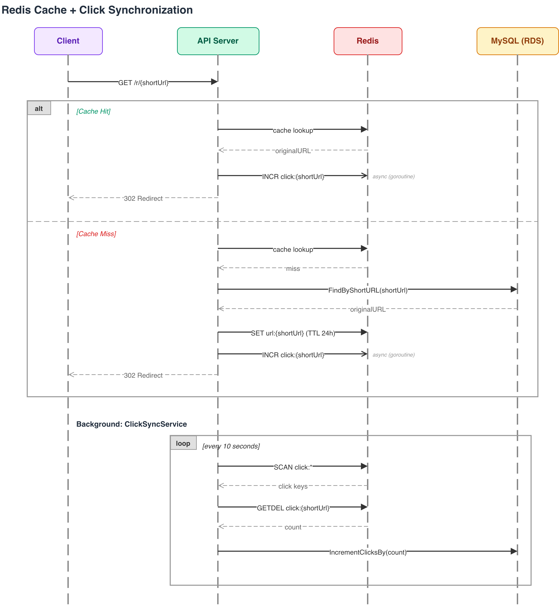
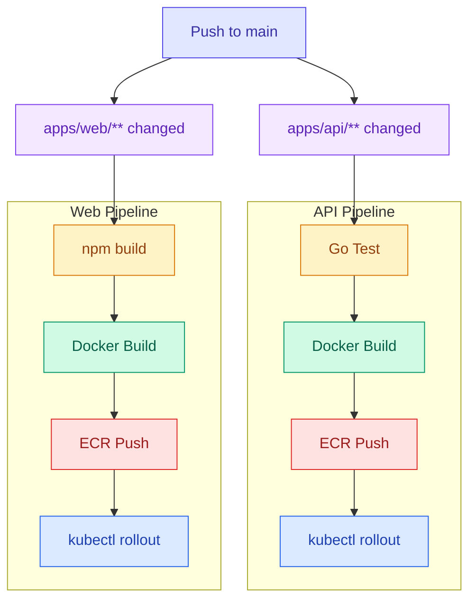
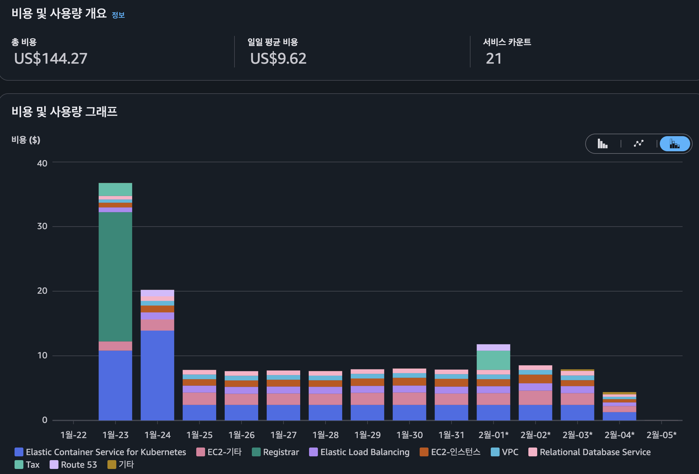

# TuneLink

> URL Shortener Service - A high-performance URL shortening service built with Go + EKS + Terraform



**Live Demo:** https://hearttune.link

## Architecture



---

## Highlights

| Metric | Result |
|--------|--------|
| Throughput | **6,500+ req/s** |
| Response Time (p95) | **109ms** |
| Concurrent Users | **1,000 VUs** |
| Error Rate | **0%** |

**93.5% response time improvement** with Redis cache (687ms -> 45ms)

---

## Tech Stack

**Backend**
- Go 1.21 + Gin Framework
- GORM (MySQL)
- Redis (Caching + Click Counter)

**Frontend**
- React 18 + TypeScript
- Vite + TailwindCSS

**Infrastructure**
- AWS EKS (Kubernetes)
- RDS MySQL + ElastiCache Redis
- ALB + ACM (HTTPS)
- Terraform (IaC)

**CI/CD & Monitoring**
- GitHub Actions
- Prometheus + Grafana
- k6 (Load Testing)

---

## Key Features

### 1. k6 Load Testing Environment

Built a Kubernetes-native load testing environment.



**Implementation Details:**
- **k6-operator**: Test definitions via Kubernetes CRD -> GitOps friendly
- **Node Isolation**: Taint/Toleration separates k6 Pods from API Pods -> Accurate performance measurement
- **On-Demand Nodes**: Nodes activated only during tests -> Cost savings
- **External Path Testing**: Tests run through the same path as real users (ALB -> API)

---

### 2. Prometheus + Grafana Monitoring


**Implementation Details:**
- **kube-prometheus-stack**: Integrated installation of Prometheus + Grafana + AlertManager via Helm
- **k6 Metrics Integration**: Real-time visualization of load test results via Prometheus Remote Write
- **Custom Dashboards**: Automatic dashboard provisioning via ConfigMap (managed by Terraform)
- **External Access**: ALB Ingress exposed at `grafana.hearttune.link`

---

### 3. Bastion Host (Private Resource Access)



Configured a Bastion Host for secure access to RDS/Redis in Private Subnets.

**Implementation Details:**
- **Elastic IP**: Fixed IP maintained even after instance restart
- **SSH Tunnel**: Direct access to RDS/Redis via SSH Tunnel from DataGrip
- **Least Privilege**: Security Group allowing only Bastion -> RDS/Redis



---

### 4. Redis Cache + Click Synchronization

Introduced a Redis caching strategy to reduce DB load and improve response speed.



**Implementation Details:**
- **URL Lookup Caching**: Cache-Aside pattern (TTL: 1h)
- **Click Counter**: Redis INCR (atomic) -> Background worker syncs to DB
- **Graceful Degradation**: Falls back to DB when Redis is unavailable

---

### 5. CI/CD Pipeline

Built an automated build/deploy pipeline with GitHub Actions.



**Implementation Details:**
- **Path-Based Triggers**: Workflows run only when `apps/api/**` or `apps/web/**` are changed
- **Image Tagging**: Tagged with Git SHA for easy rollback
- **Zero-Downtime Deployment**: Rolling Update via `kubectl rollout restart`

---

## Performance Optimization

### Before and After Redis Cache

| Metric | Before | After | Improvement |
|--------|--------|-------|-------------|
| Avg Response Time | 687ms | 45ms | **-93.5%** |
| p(95) Response Time | 2.47s | 109ms | **-95.6%** |
| Throughput | 1,187 req/s | 6,504 req/s | **+448%** |

### Problems Solved

| Problem | Cause | Solution |
|---------|-------|----------|
| Too many connections | Connection Pool not configured | Limited to 25 connections per Pod |
| 50% click count loss | Read-Modify-Write Race Condition | Atomic SQL update (`clicks = clicks + 1`) |
| Response delay under high load | DB query on every request | Redis caching + click batch synchronization |

---

## Quick Start

### Local Development Environment

```bash
# 1. Start infrastructure (MySQL, Redis)
docker-compose up -d

# 2. Run API server
cd apps/api
go run cmd/api/main.go

# 3. Run Web
cd apps/web
npm install && npm run dev
```

### API Endpoints

| Method | Path | Description |
|--------|------|-------------|
| GET | `/health` | Health check |
| POST | `/api/urls` | Create shortened URL |
| GET | `/r/{shortUrl}` | Redirect |

---

## Project Structure

```
tunelink/
├── apps/
│   ├── api/                       # Go API server
│   │   ├── cmd/api/               # Entry point (main.go)
│   │   └── internal/              # Hexagonal architecture
│   │       ├── adapter/in/http/   # HTTP handler, DTO
│   │       ├── adapter/out/       # Cache (Redis/Noop), Persistence (MySQL)
│   │       ├── application/       # Use cases, Ports
│   │       ├── domain/            # Entity, Repository interface
│   │       └── infrastructure/    # Config
│   └── web/                       # React frontend (Vite + TypeScript)
│
├── infra/
│   ├── main.tf                    # Root Terraform configuration
│   ├── variables.tf / outputs.tf
│   └── modules/
│       ├── vpc/                   # VPC, Subnet, NAT Gateway
│       ├── eks/                   # EKS Cluster + Node Groups
│       ├── rds/                   # MySQL (RDS)
│       ├── elasticache/           # Redis (ElastiCache)
│       ├── ecr/                   # Container Registry
│       ├── bastion/               # Bastion Host + Elastic IP
│       ├── alb_controller/        # AWS Load Balancer Controller
│       ├── k8s_base/              # K8s Namespace, Ingress, Secrets
│       ├── k8s_api/               # API Deployment + Service
│       ├── k8s_web/               # Web Deployment + Service
│       ├── monitoring/            # Prometheus + Grafana
│       └── k6_operator/           # k6 Load Testing (scripts + testruns)
│
├── .github/workflows/             # CI/CD Pipeline (api.yml, web.yml)
├── docker-compose.yml             # Local development
├── Makefile                       # Build & deploy commands
└── docs/                          # Project documentation
```

---

## Documentation

| Document | Description |
|----------|-------------|
| [spec.md](docs/spec.md) | Project planning and design |
| [deploy.md](docs/deploy.md) | AWS deployment guide (end-to-end) |
| [monitoring.md](docs/monitoring.md) | Prometheus + Grafana setup |
| [test.md](docs/test.md) | k6 load testing strategy |
| [test-result.md](docs/test-result.md) | Load test results and improvement history |
| [troubleshooting.md](docs/troubleshooting.md) | Troubleshooting guide |

---

## Cost



Actual cost for ~2 weeks (2026.01.23 ~ 02.05):

| Service | Cost |
|---------|------|
| EKS Control Plane | $50 |
| EC2-Other (NAT Gateway, EBS) | $23 |
| Domain Registration | $20 |
| ALB (Load Balancer) | $13 |
| EC2 Instances (Spot) | $13 |
| VPC | $9 |
| RDS (MySQL) | $9 |
| Tax | $5 |
| Route 53 | $2 |
| ElastiCache (Redis) | $1 |
| **Total** | **$144** |

---

## License

MIT
