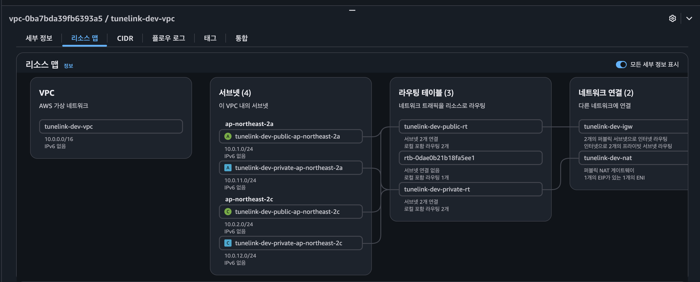

# TuneLink

> URL Shortener 서비스 - Go + EKS + Terraform으로 구축한 고성능 단축 URL 서비스


**Live Demo:** https://hearttune.link

---

## Highlights

| 지표 | 결과 |
|------|------|
| 처리량 | **6,500+ req/s** |
| 응답시간 (p95) | **109ms** |
| 동시접속 | **1,000 VUs** |
| 에러율 | **0%** |

Redis 캐시 도입으로 **93.5% 응답시간 개선** (687ms → 45ms)

---

## Tech Stack

**Backend**
- Go 1.21 + Gin Framework
- GORM (MySQL)
- Redis (캐싱 + 클릭 카운터)

**Frontend**
- React 18 + TypeScript
- Vite + TailwindCSS

**Infrastructure**
- AWS EKS (Kubernetes)
- RDS MySQL + ElastiCache Redis
- ALB + ACM (HTTPS)
- Terraform (IaC)

**CI/CD & Monitoring**
- GitHub Actions
- Prometheus + Grafana
- k6 (부하테스트)

---

## Architecture



```
                         Internet
                            │
                            ▼
                    ┌──────────────┐
                    │   Route 53   │
                    │ hearttune.link│
                    └──────┬───────┘
                           │
                    ┌──────▼───────┐
                    │  ALB (HTTPS) │
                    └──────┬───────┘
                           │
        ┌──────────────────┴──────────────────┐
        │              EKS Cluster             │
        │                                      │
        │   ┌─────────┐      ┌─────────┐      │
        │   │   API   │      │   Web   │      │
        │   │  (Go)   │      │ (React) │      │
        │   └────┬────┘      └─────────┘      │
        │        │                            │
        └────────┼────────────────────────────┘
                 │
        ┌────────┴────────┐
        │                 │
   ┌────▼────┐      ┌─────▼─────┐
   │  MySQL  │      │   Redis   │
   │  (RDS)  │      │(ElastiCache)│
   └─────────┘      └───────────┘
```

---

## Key Features

### 1. k6 부하테스트 환경

Kubernetes-native 부하테스트 환경을 구축했습니다.

```
┌─────────────────────────────────────────────────────────┐
│                      EKS Cluster                         │
│                                                          │
│  ┌────────────────────┐    ┌────────────────────────┐   │
│  │   일반 노드 그룹    │    │   Loadtest 노드 그룹    │   │
│  │                    │    │   (Taint로 격리)        │   │
│  │  ┌─────┐ ┌─────┐  │    │  ┌──────────────────┐  │   │
│  │  │ API │ │ Web │  │    │  │  k6 Runner Pods  │  │   │
│  │  └─────┘ └─────┘  │    │  └────────┬─────────┘  │   │
│  └────────────────────┘    └───────────┼────────────┘   │
│                                        │                 │
│                                        ▼                 │
│                               https://hearttune.link     │
└─────────────────────────────────────────────────────────┘
```

**구현 포인트:**
- **k6-operator**: Kubernetes CRD로 테스트 정의 → GitOps 친화적
- **노드 격리**: Taint/Toleration으로 k6 Pod와 API Pod 분리 → 정확한 성능 측정
- **온디맨드 노드**: 테스트 시에만 노드 활성화 → 비용 절약
- **외부 경로 테스트**: 실제 사용자와 동일한 경로(ALB → API)로 테스트

---

### 2. Prometheus + Grafana 모니터링


**구현 포인트:**
- **kube-prometheus-stack**: Helm으로 Prometheus + Grafana + AlertManager 통합 설치
- **k6 메트릭 연동**: Prometheus Remote Write로 부하테스트 결과 실시간 시각화
- **커스텀 대시보드**: ConfigMap으로 대시보드 자동 프로비저닝 (Terraform 관리)
- **외부 접근**: `grafana.hearttune.link`로 ALB Ingress 노출

---

### 3. Bastion Host (Private 리소스 접근)


Private Subnet의 RDS/Redis에 안전하게 접근하기 위한 Bastion Host를 구성했습니다.

**구현 포인트:**
- **Elastic IP**: 인스턴스 재시작해도 IP 고정 유지
- **SSH 터널**: DataGrip에서 SSH Tunnel로 RDS/Redis 직접 접속
- **최소 권한**: Bastion → RDS/Redis만 허용하는 Security Group


---

### 4. Redis 캐시 + 클릭 동기화

DB 부하를 줄이고 응답 속도를 높이기 위해 Redis 캐싱 전략을 도입했습니다.

```
┌─────────────┐     ┌─────────────┐     ┌─────────────┐
│   Client    │────▶│    API      │────▶│   Redis     │
└─────────────┘     └──────┬──────┘     └──────┬──────┘
                           │                    │
                           │ cache miss         │ INCR clicks
                           ▼                    │
                    ┌─────────────┐             │
                    │    MySQL    │◀────────────┘
                    │    (RDS)    │    batch sync
                    └─────────────┘
```

**구현 포인트:**
- **URL 조회 캐싱**: Cache-Aside 패턴 (TTL: 1h)
- **클릭 카운터**: Redis INCR (원자적) → 백그라운드 워커가 DB 동기화
- **Graceful Degradation**: Redis 장애 시 DB fallback

---

### 5. CI/CD 파이프라인

GitHub Actions로 자동 빌드/배포 파이프라인을 구성했습니다.

```
Push to main
     │
     ├─── apps/api/** 변경
     │         │
     │         ▼
     │    Go Test → Docker Build → ECR Push → kubectl rollout
     │
     └─── apps/web/** 변경
               │
               ▼
          npm build → Docker Build → ECR Push → kubectl rollout
```

**구현 포인트:**
- **경로 기반 트리거**: `apps/api/**`, `apps/web/**` 변경 시에만 해당 워크플로우 실행
- **이미지 태깅**: Git SHA로 태깅하여 롤백 용이
- **무중단 배포**: `kubectl rollout restart`로 Rolling Update

---

## Performance Optimization

### Redis 캐시 도입 전후 비교

| 지표 | Before | After | 개선율 |
|------|--------|-------|--------|
| 평균 응답시간 | 687ms | 45ms | **-93.5%** |
| p(95) 응답시간 | 2.47s | 109ms | **-95.6%** |
| 처리량 | 1,187 req/s | 6,504 req/s | **+448%** |

### 해결한 문제들

| 문제 | 원인 | 해결 |
|------|------|------|
| Too many connections | Connection Pool 미설정 | Pod당 25개 연결 제한 |
| 클릭 수 50% 누락 | Read-Modify-Write Race Condition | SQL 원자적 업데이트 (`clicks = clicks + 1`) |
| 고부하 시 응답 지연 | 매 요청마다 DB 조회 | Redis 캐싱 + 클릭 배치 동기화 |

---

## Quick Start

### 로컬 개발 환경

```bash
# 1. 인프라 실행 (MySQL, Redis)
docker-compose up -d

# 2. API 서버 실행
cd apps/api
go run cmd/api/main.go

# 3. Web 실행
cd apps/web
npm install && npm run dev
```

### API Endpoints

| Method | Path | 설명 |
|--------|------|------|
| GET | `/health` | 헬스체크 |
| POST | `/api/urls` | URL 단축 생성 |
| GET | `/r/{shortUrl}` | 리다이렉트 |

---

## Project Structure

```
tunelink/
├── apps/
│   ├── api/                 # Go API 서버
│   │   ├── cmd/api/         # 엔트리포인트
│   │   └── internal/        # 비즈니스 로직
│   └── web/                 # React 프론트엔드
│
├── infra/
│   └── terraform/
│       ├── modules/         # 재사용 가능한 Terraform 모듈
│       │   ├── vpc/         # VPC, Subnet, NAT Gateway
│       │   ├── eks/         # EKS 클러스터 + 노드 그룹
│       │   ├── rds/         # MySQL (RDS)
│       │   ├── elasticache/ # Redis (ElastiCache)
│       │   ├── bastion/     # Bastion Host + Elastic IP
│       │   ├── monitoring/  # Prometheus + Grafana
│       │   ├── k6_operator/ # k6 부하테스트
│       │   └── ...
│       └── envs/dev/        # 환경별 설정
│
├── .github/workflows/       # CI/CD 파이프라인
└── docs/                    # 프로젝트 문서
```

---

## Documentation

| 문서 | 설명 |
|------|------|
| [spec.md](docs/spec.md) | 프로젝트 기획 및 설계 |
| [deploy.md](docs/deploy.md) | AWS 배포 가이드 (처음부터 끝까지) |
| [monitoring.md](docs/monitoring.md) | Prometheus + Grafana 설정 |
| [test.md](docs/test.md) | k6 부하테스트 전략 |
| [test-result.md](docs/test-result.md) | 부하테스트 결과 및 개선 히스토리 |
| [troubleshooting.md](docs/troubleshooting.md) | 트러블슈팅 가이드 |

---

## Cost (Dev Environment)


| 리소스 | 월 비용 |
|--------|--------|
| EKS Control Plane | $73 |
| EC2 Nodes (Spot) | $10 |
| RDS (db.t3.micro) | $15 |
| ElastiCache | $12 |
| ALB | $20 |
| NAT Gateway | $32 |
| **Total** | **~$162/월** |

> Spot Instance 사용으로 On-Demand 대비 **~70% 비용 절감**

---

## License

MIT
