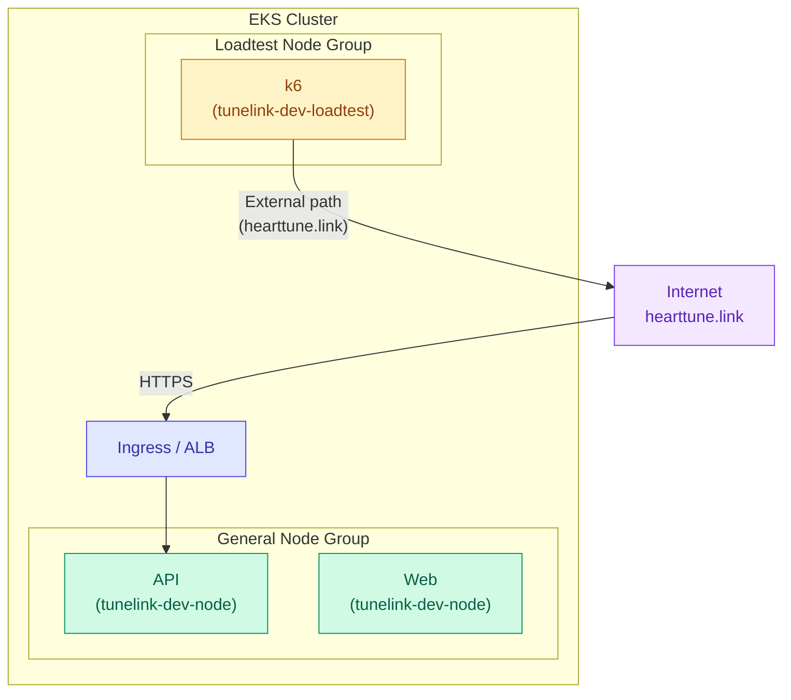

# Loadtest Node Isolation Setup

## Overview

This is the configuration for isolating k6 load test Pods from API Pods to ensure accurate performance measurement.

## Architecture



> **Note**: Since k6 tests through the external URL (`https://hearttune.link`), load testing is conducted through the same path as actual users (Ingress/ALB -> API).

## Why Isolate?

| Approach | Problem |
|------|--------|
| Same node | k6 uses CPU/Memory -> API performance degrades -> Results are skewed |
| **Different node (isolated)** | No resource contention -> Accurate measurement |

## Terraform Configuration

### Node Group Configuration (`infra/modules/eks/main.tf`)

```hcl
# Dedicated loadtest node group
resource "aws_eks_node_group" "loadtest" {
  count = var.loadtest_node_enabled ? 1 : 0

  node_group_name = "${local.name_prefix}-loadtest"
  instance_types  = ["t3.xlarge", "t3a.xlarge"]  # 4 vCPU, 16GB
  capacity_type   = "SPOT"

  scaling_config {
    desired_size = var.loadtest_node_desired_size
    min_size     = 0
    max_size     = 2
  }

  labels = {
    role = "loadtest"
  }

  taint {
    key    = "role"
    value  = "loadtest"
    effect = "NO_SCHEDULE"
  }
}
```

### Variable Configuration (`infra/main.tf`)

```hcl
module "eks" {
  # ...

  # Loadtest node (enable only during testing)
  loadtest_node_enabled      = true
  loadtest_node_desired_size = 0  # 0 = off, 1 = on
}
```

## Usage

### 1. Before Testing: Turn On the Node

```bash
# Edit infra/main.tf
loadtest_node_desired_size = 1

# Apply
cd infra
terraform apply -target=module.eks

# Verify node is Ready (takes 1-2 minutes)
kubectl get nodes -l role=loadtest
```

### 2. Run the Test

The k6 TestRun requires nodeSelector and toleration:

```yaml
spec:
  runner:
    nodeSelector:
      role: loadtest
    tolerations:
      - key: "role"
        operator: "Equal"
        value: "loadtest"
        effect: "NoSchedule"
```

### 3. After Testing: Turn Off the Node

```bash
# Edit infra/main.tf
loadtest_node_desired_size = 0

# Apply
cd infra
terraform apply -target=module.eks
```

## Taint & Toleration Explanation

### Taint (set on the node)
```yaml
taint:
  key: role
  value: loadtest
  effect: NO_SCHEDULE
```
-> Regular Pods will not be scheduled on this node

### Toleration (set on the Pod)
```yaml
tolerations:
  - key: "role"
    operator: "Equal"
    value: "loadtest"
    effect: "NoSchedule"
```
-> Only k6 Pods are allowed to be scheduled on this node

## Cost

| State | Node Count | Cost |
|------|--------|------|
| Normal (off) | 0 | $0 |
| During testing (on) | 1 | ~$0.05/hour (SPOT t3.xlarge, 4 vCPU, 16GB) |

> **Note**: SPOT pricing varies by availability zone and time of day. 60-70% cheaper compared to On-Demand.

## Cautions

1. **SPOT instances**: Nodes may be terminated during testing (rare)
2. **Node startup time**: Takes 1-2 minutes
3. **Turn off after testing**: Always turn off to save costs

## Related Files

- `infra/modules/eks/main.tf` - Node group definition
- `infra/modules/eks/variables.tf` - Variable definitions
- `infra/main.tf` - Variable value configuration
- `.claude/skills/k6-load-test/SKILL.md` - Test skill
