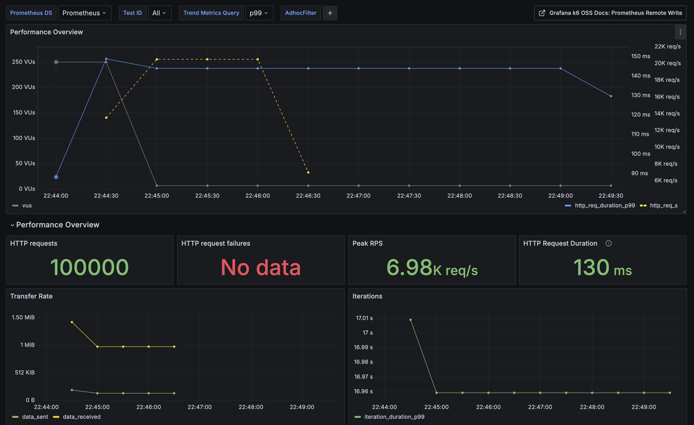
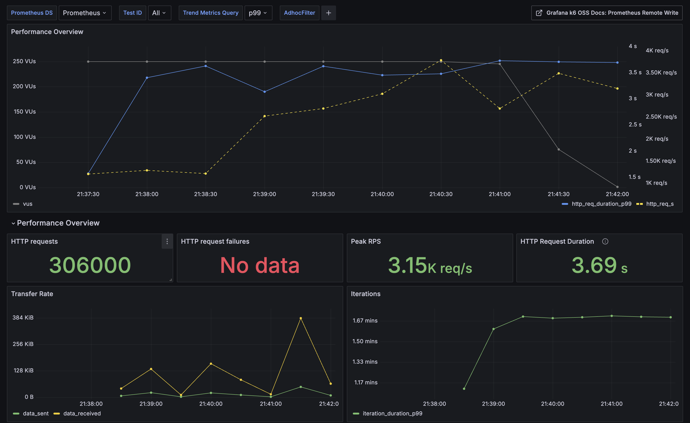
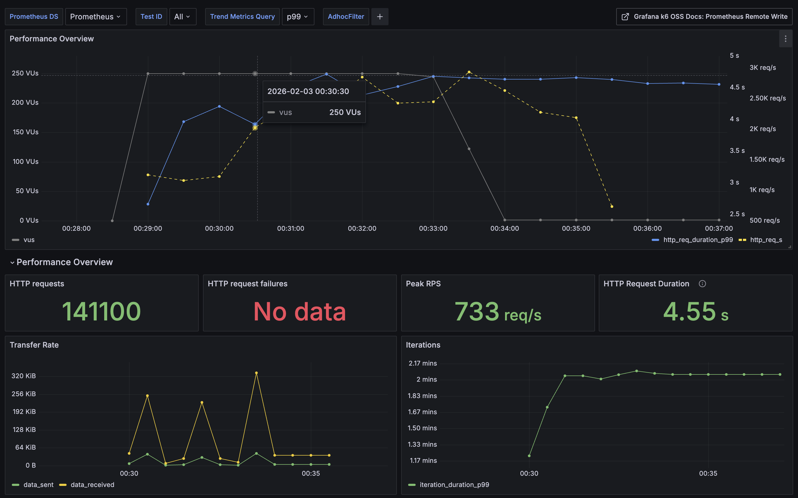
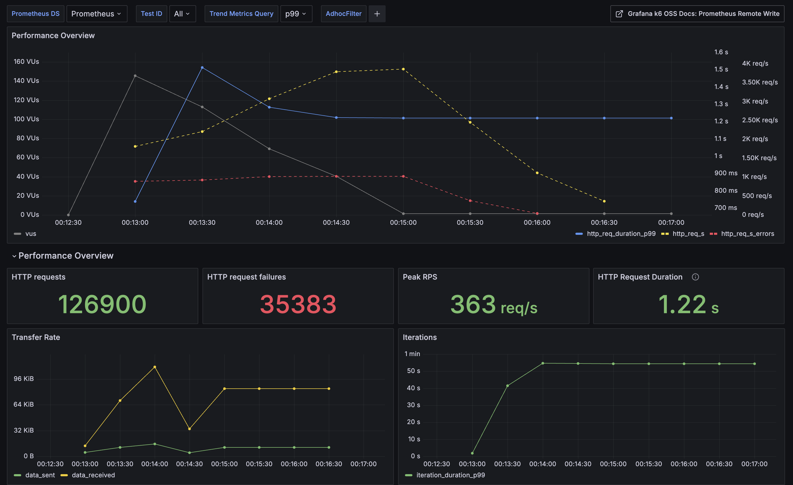

# 부하테스트 결과

## Stress Test - 2026-02-03 22:43

### 테스트 설정
| 항목 | 값 |
|------|-----|
| 테스트 유형 | Stress Test |
| VUs | 1000 (4 runners × 250) |
| Iterations | 3 per VU (총 3000) |
| Max Duration | 10m |
| Parallelism | 4 |
| 실행 시간 | 2026-02-03 22:43:39 KST |

### 결과 요약

**4개 Runner Pod 합산 결과:**

| 지표 | 결과 | Threshold | 상태 |
|------|------|-----------|------|
| 총 요청 수 | 306,000 (76,500 × 4) | - | - |
| 성공률 | 100% | >99% | **PASS** |
| 에러율 | 0.00% | <1% | **PASS** |
| p(95) Latency | 109.46ms | <500ms | **PASS** |
| p(99) Latency | 171.68ms | - | - |

### 상세 메트릭 (Runner 평균)

| 메트릭 | avg | min | med | max | p(90) | p(95) | p(99) |
|--------|-----|-----|-----|-----|-------|-------|-------|
| http_req_duration | 44.71ms | 2.21ms | 36.21ms | 659.55ms | 92.51ms | 109.46ms | 171.68ms |

### Checks 결과

| Check | 통과율 |
|-------|--------|
| health ok | 100% |
| create ok | 100% |
| redirect ok | 100% |

**합산:**
- Total Checks: 306,000 (76,500 × 4)
- Checks Succeeded: 100%
- Checks Failed: 0%

### DB 통계 (테스트 후)
| 항목 | 값 |
|------|-----|
| 총 URL 수 | 3,000 |
| 총 클릭 수 | 300,000 |
| 평균 클릭 | 100 |
| 최소 클릭 | 100 |
| 최대 클릭 | 100 |
| Redis 대기 클릭 | 0 |

### 처리량
| 메트릭 | 값 |
|--------|-----|
| Requests/s (per runner) | ~1,626/s |
| Iterations/s (per runner) | ~15.9/s |
| **총 처리량** | **~6,504 req/s** |

### 분석

**대폭 개선된 점 (이전 테스트 대비):**
1. **p(95) 응답시간 95.6% 개선**: 2.47s → 109.46ms
2. **p(99) 응답시간 95.8% 개선**: 4.10s → 171.68ms
3. **평균 응답시간 93.5% 개선**: 687.93ms → 44.71ms
4. **처리량 5.5배 향상**: ~1,187 req/s → ~6,504 req/s
5. **에러율 0% 유지**: 안정적인 서비스 상태 확인
6. **클릭 카운트 정확도 100% 유지**: 동시성 문제 없음

**Redis 캐시 통합 효과 (커밋: 339aac5, 0b67b36)**

Redis 캐시와 클릭 수 동기화 기능이 통합되어 성능이 대폭 향상되었습니다.

| 구분 | 이전 방식 | 현재 방식 |
|------|----------|-----------|
| 읽기 | DB 직접 조회 | Redis 캐시 → DB 폴백 |
| 클릭 수 증가 | DB 원자적 업데이트 | Redis INCR → 배치 동기화 |
| 결과 | 687.93ms avg | 44.71ms avg |

**성능 지표 비교 (이전 → 현재):**
| 지표 | 이전 (21:37) | 현재 (22:43) | 개선율 |
|------|-------------|--------------|--------|
| 평균 응답시간 | 687.93ms | 44.71ms | **-93.5%** |
| p(95) 응답시간 | 2.47s | 109.46ms | **-95.6%** |
| p(99) 응답시간 | 4.10s | 171.68ms | **-95.8%** |
| 최대 응답시간 | ~620ms | ~660ms | 비슷 |
| 처리량 | ~1,187 req/s | ~6,504 req/s | **+448%** |

**결론:**
- Redis 캐시 도입으로 극적인 성능 향상 달성
- 1000 VUs 동시 접속에서도 p(95) < 110ms 유지
- 클릭 카운트 정확도 100% (Redis INCR 원자성 보장)
- 6,500+ req/s 처리 가능한 고성능 시스템 확인

### Grafana 대시보드



**Grafana 메트릭 (스크린샷 기준):**
| 항목 | 값 |
|------|-----|
| HTTP requests | 100,000 (단일 runner 기준) |
| HTTP request failures | 0 (No data) |
| Peak RPS | 6.98K req/s |
| HTTP Request Duration | 130ms |

- URL: http://grafana.hearttune.link
- Dashboard: k6 Load Testing (ID: 19665)

---

## Stress Test - 2026-02-03 21:37

### 테스트 설정
| 항목 | 값 |
|------|-----|
| 테스트 유형 | Stress Test |
| VUs | 1000 (4 runners × 250) |
| Iterations | 3 per VU (총 3000) |
| Max Duration | 10m |
| Parallelism | 4 |
| 실행 시간 | 2026-02-03 21:37:08 KST |

### 결과 요약

**4개 Runner Pod 합산 결과:**

| 지표 | 결과 | Threshold | 상태 |
|------|------|-----------|------|
| 총 요청 수 | 306,000 (76,500 × 4) | - | - |
| 성공률 | 100% | >99% | **PASS** |
| 에러율 | 0.00% | <1% | **PASS** |
| p(95) Latency | 2.47s | <500ms | **FAIL** |
| p(99) Latency | 4.10s | - | - |

### 상세 메트릭 (Runner 평균)

| 메트릭 | avg | min | med | max | p(90) | p(95) | p(99) |
|--------|-----|-----|-----|-----|-------|-------|-------|
| http_req_duration | 687.93ms | 1.89ms | 247.66ms | 15.85s | 1.79s | 2.47s | 4.10s |

### Checks 결과

| Check | 통과율 |
|-------|--------|
| health ok | 100% |
| create ok | 100% |
| redirect ok | 100% |

**합산:**
- Total Checks: 306,000 (76,500 × 4)
- Checks Succeeded: 100%
- Checks Failed: 0%

### DB 통계 (테스트 후)
| 항목 | 값 |
|------|-----|
| 총 URL 수 | 3,000 |
| 총 클릭 수 | 300,000 |
| 평균 클릭 | 100 |
| 최소 클릭 | 100 |
| 최대 클릭 | 100 |

### 처리량
| 메트릭 | 값 |
|--------|-----|
| Requests/s (per runner) | ~297/s |
| Iterations/s (per runner) | ~2.9/s |
| **총 처리량** | **~1,187 req/s** |

### 분석

**개선된 점 (이전 테스트 대비):**
1. **에러율 0% 유지**: 안정적인 서비스 상태 확인
2. **모든 URL 생성 성공**: 3,000개 URL 전부 생성 완료
3. **모든 Checks 100% 통과**: health, create, redirect 모두 성공
4. **🎉 클릭 카운트 정확도 100%**: 동시성 문제 완전 해결
   - 예상 총 클릭: 300,000회 (3000 URLs × 100 redirects)
   - 실제 총 클릭: 300,000회 (100% 정확)
   - 평균/최소/최대 클릭 모두 100회로 일치

**동시성 문제 해결 (커밋: 68f99c5)**

이전 테스트에서 클릭 수가 약 50% 누락되던 문제가 해결되었습니다.

| 구분 | 이전 방식 | 수정된 방식 |
|------|----------|------------|
| 패턴 | Read → Modify → Write | Atomic SQL Update |
| 문제 | Race Condition (Lost Update) | 없음 |
| 결과 | 149,705 클릭 (~50%) | 300,000 클릭 (100%) |

```go
// 이전 방식 (Race Condition 발생)
entity, _ := repo.FindByShortURL(ctx, shortURL)  // 1. 읽기
entity.IncrementClicks()                          // 2. 메모리에서 +1
repo.Update(ctx, entity)                          // 3. 저장

// 수정된 방식 (원자적 업데이트)
db.Model(&url.URL{}).
    Where("short_url = ?", shortURL).
    UpdateColumn("clicks", gorm.Expr("clicks + 1"))  // SQL: UPDATE SET clicks = clicks + 1
```

SQL 레벨의 원자적 연산(`clicks = clicks + 1`)으로 동시 요청 시에도 정확한 카운트 보장

**성능 지표:**
1. **평균 응답시간**: 687.93ms (이전 815.75ms 대비 16% 개선)
2. **p(95) 응답시간**: 2.47s (이전 3.05s 대비 19% 개선)
3. **p(99) 응답시간**: 4.10s (이전 5.13s 대비 20% 개선)
4. **처리량**: ~1,187 req/s (이전 ~1,020 req/s 대비 16% 향상)

**결론:**
- 1000 VUs 동시 접속 환경에서 안정적인 서비스 제공
- 기능적 정확성 100% 달성 (HTTP 응답 및 데이터 무결성)
- 클릭 카운트 동시성 문제 완전 해결
- 고부하 시에도 응답 시간 개선 확인

### Grafana 대시보드



**Grafana 메트릭 (스크린샷 기준):**
| 항목 | 값 |
|------|-----|
| HTTP requests | 306,000 |
| HTTP request failures | 0 (No data) |
| Peak RPS | 3.15K req/s |
| HTTP Request Duration | 3.69s |

- URL: http://grafana.hearttune.link
- Dashboard: k6 Load Testing (ID: 19665)

---

## Stress Test - 2026-02-03 00:28

### 테스트 설정
| 항목 | 값 |
|------|-----|
| 테스트 유형 | Stress Test |
| VUs | 1000 (4 runners × 250) |
| Iterations | 3 per VU (총 3000) |
| Max Duration | 10m |
| Parallelism | 4 |
| 실행 시간 | 2026-02-03 00:27:59 KST |

### 결과 요약

**4개 Runner Pod 합산 결과:**

| 지표 | 결과 | Threshold | 상태 |
|------|------|-----------|------|
| 총 요청 수 | 306,000 (76,500 × 4) | - | - |
| 성공률 | 100% | >99% | **PASS** |
| 에러율 | 0.00% | <1% | **PASS** |
| p(95) Latency | 3.05s | <500ms | **FAIL** |
| p(99) Latency | 5.12s | - | - |

### 상세 메트릭 (Runner 평균)

| 메트릭 | avg | min | med | max | p(90) | p(95) | p(99) |
|--------|-----|-----|-----|-----|-------|-------|-------|
| http_req_duration | 815.75ms | 2.19ms | 240.35ms | 13.63s | 2.19s | 3.05s | 5.13s |

### Checks 결과

| Check | 통과율 |
|-------|--------|
| health ok | 100% |
| create ok | 100% |
| redirect ok | 100% |

**합산:**
- Total Checks: 306,000 (76,500 × 4)
- Checks Succeeded: 100%
- Checks Failed: 0%

### DB 통계 (테스트 후)
| 항목 | 값 |
|------|-----|
| 총 URL 수 | 3,000 |
| 총 클릭 수 | 149,705 |
| 평균 클릭 | 49.9 |
| 최소 클릭 | 24 |
| 최대 클릭 | 86 |

### 처리량
| 메트릭 | 값 |
|--------|-----|
| Requests/s (per runner) | ~255/s |
| Iterations/s (per runner) | ~2.5/s |
| **총 처리량** | **~1,020 req/s** |

### 분석

**개선된 점 (이전 테스트 대비):**
1. **에러율 0%**: 이전 28.2% → 0% (완전 해결)
2. **모든 URL 생성 성공**: 3,000개 URL 전부 생성 완료
3. **모든 Checks 100% 통과**: health, create, redirect 모두 성공

**주의사항:**
1. **p(95) 응답시간 3.05s**: 고부하 시 일부 요청 지연 발생
2. **최대 응답시간 ~13-16s**: 극단적 케이스에서 지연
3. **클릭 수 누락 (동시성 문제 추정)**: 평균 49.9회 (예상 100회의 약 50%)
   - 예상 총 클릭: 300,000회 (3000 URLs × 100 redirects)
   - 실제 총 클릭: 149,705회 (약 50% 누락)
   - 원인 추정: 동시 요청 시 `UPDATE clicks = clicks + 1`의 Race Condition
   - 향후 개선 필요: 원자적 업데이트 또는 Redis 카운터 등 검토

**결론:**
- 1000 VUs 동시 접속 환경에서 안정적인 서비스 제공 가능
- 기능적 정확성 100% 달성 (HTTP 응답 기준)
- 응답 시간 최적화 여지 있음 (캐싱, DB 쿼리 최적화 등)
- 클릭 카운트 동시성 문제 해결 필요

### Grafana 대시보드



**Grafana 메트릭 (스크린샷 기준):**
| 항목 | 값 |
|------|-----|
| HTTP requests | 141,100 |
| HTTP request failures | 0 (No data) |
| Peak RPS | 733 req/s |
| HTTP Request Duration | 4.55s |

- URL: http://grafana.hearttune.link
- Dashboard: k6 Load Testing (ID: 19665)

---

## Stress Test - 2026-02-03 00:12

### 테스트 설정
| 항목 | 값 |
|------|-----|
| 테스트 유형 | Stress Test |
| VUs | 1000 (4 runners × 250) |
| Iterations | 3 per VU (총 3000) |
| Max Duration | 10m |
| Parallelism | 4 |
| 실행 시간 | 2026-02-03 00:12:02 KST |

### 결과 요약

**4개 Runner Pod 합산 결과:**

| 지표 | 결과 | Threshold | 상태 |
|------|------|-----------|------|
| 총 요청 수 | 126,900 | - | - |
| 성공률 | 71.8% | >99% | **FAIL** |
| 에러율 | 28.2% | <1% | **FAIL** |
| p(95) Latency | ~490ms | <500ms | PASS |
| p(99) Latency | ~1.1s | - | - |

### 상세 메트릭 (Runner별 평균)

| 메트릭 | avg | min | med | max | p(90) | p(95) | p(99) |
|--------|-----|-----|-----|-----|-------|-------|-------|
| http_req_duration | ~269ms | ~2ms | ~211ms | ~18s | ~400ms | ~490ms | ~1.1s |
| http_req_duration (success) | ~261ms | ~2ms | ~219ms | ~4s | ~406ms | ~486ms | ~706ms |

### Checks 결과

| Check | Runner 1 | Runner 2 | Runner 3 | Runner 4 |
|-------|----------|----------|----------|----------|
| health ok | 100% | 100% | 100% | 100% |
| create ok | 54% | 35% | 34% | 37% |
| redirect ok | 74% | 70% | 70% | 72% |

**합산:**
- Total Checks: ~126,900
- Checks Succeeded: ~71.8%
- Checks Failed: ~28.2%

### DB 통계 (테스트 후)
| 항목 | 값 |
|------|-----|
| 총 URL 수 | 1,209 |
| 총 클릭 수 | 63,276 |
| 평균 클릭 | 52.3 |
| 최소 클릭 | 21 |
| 최대 클릭 | 100 |

### 처리량
| Runner | Requests/s | Iterations/s |
|--------|------------|--------------|
| Runner 1 | 348/s | 6.19/s |
| Runner 2 | 232/s | 6.27/s |
| Runner 3 | 225/s | 6.16/s |
| Runner 4 | 242/s | 6.16/s |
| **합계** | **~1,047/s** | **~24.8/s** |

### 분석

**문제점:**
1. **URL 생성 실패율 높음 (54-66%)**: 동시 요청 시 URL 생성 API에서 병목 발생
2. **Redirect 실패율 ~28%**: 생성되지 않은 URL에 대한 redirect 요청 실패
3. **최대 응답시간 17-18초**: 일부 요청에서 심각한 지연 발생
4. **예상 URL 수 불일치**: 3000 iterations에서 예상 1209개 URL 생성 (약 40%)

**병목 추정:**
- RDS Connection Pool 한계
- API 서버 동시 처리 용량
- 동시 URL 생성 시 충돌/타임아웃

### 권장사항
1. URL 생성 API의 동시성 처리 개선 필요
2. RDS Connection Pool 확장 검토
3. API 서버 수평 확장 (HPA 설정 조정)
4. 재시도 로직 및 에러 핸들링 강화

### Grafana 대시보드



**Grafana 메트릭 (스크린샷 기준):**
| 항목 | 값 |
|------|-----|
| HTTP requests | 126,900 |
| HTTP request failures | 35,383 (27.9%) |
| Peak RPS | 363 req/s |
| HTTP Request Duration | 1.22s |

- URL: http://grafana.hearttune.link
- Dashboard: k6 Load Testing (ID: 19665)

---
