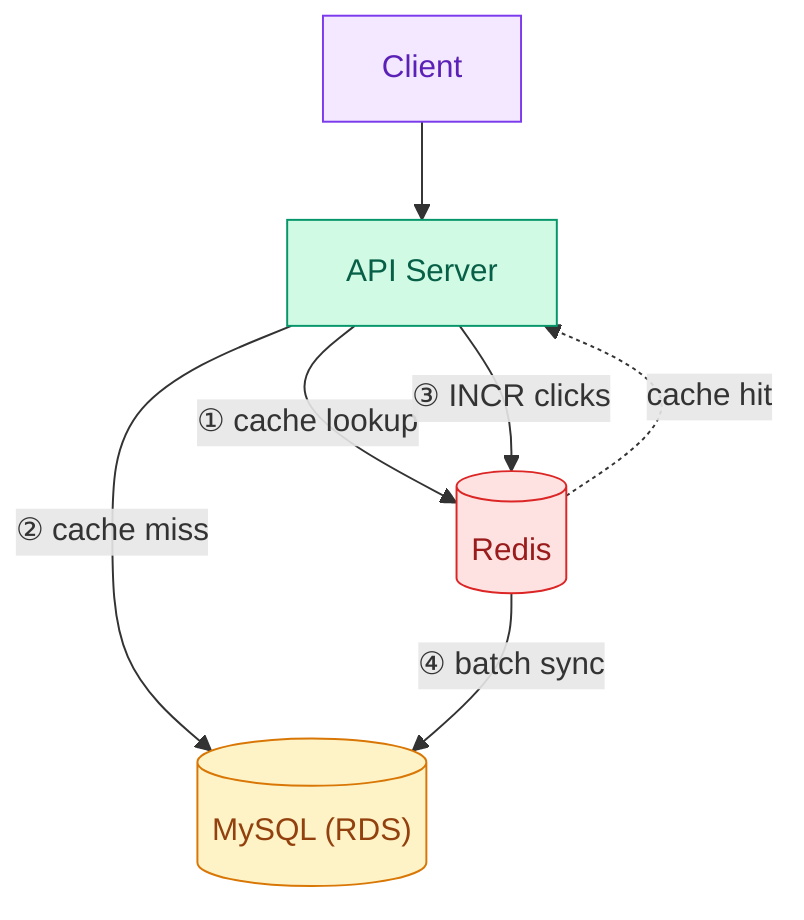

# Troubleshooting Guide

## Terraform

### Security Group Rules Recreated on Every Apply

**Date:** 2026-01-25

**Symptoms:**

- `aws_security_group_rule` resources are recreated every time `terraform apply` is run
- Example: `module.bastion.aws_security_group_rule.rds_from_bastion` is repeatedly created

**Cause:**

- Using **inline rules** (`ingress {}`, `egress {}` blocks) and **aws_security_group_rule** resources simultaneously in a Security Group
- During apply, Terraform keeps only inline rules and deletes externally added rules
- On the next apply, the deleted rules are recreated, causing an infinite loop

**Problematic Code Example:**

```hcl
# RDS module - using inline rules
resource "aws_security_group" "rds" {
  ingress {  # inline rule
    from_port   = 3306
    ...
  }
}

# Bastion module - adding rules to the same SG as a separate resource
resource "aws_security_group_rule" "rds_from_bastion" {
  security_group_id = var.rds_security_group_id  # Conflict!
  ...
}
```

**Solution:**

- Remove inline rules from the Security Group and separate all rules into `aws_security_group_rule` resources

```hcl
# Security Group (without rules)
resource "aws_security_group" "rds" {
  name        = "rds-sg"
  description = "Security group for RDS"
  vpc_id      = var.vpc_id
  tags = { Name = "rds-sg" }
}

# Separated into individual resources
resource "aws_security_group_rule" "rds_ingress_vpc" {
  type              = "ingress"
  from_port         = 3306
  to_port           = 3306
  protocol          = "tcp"
  cidr_blocks       = ["10.0.0.0/16"]
  security_group_id = aws_security_group.rds.id
}
```

**Notes:**

- The official Terraform documentation also advises against mixing inline rules with aws_security_group_rule
- When multiple modules need to add rules to the same Security Group, always use `aws_security_group_rule`

---

### InvalidPermission.Duplicate Error After Separating Security Group Rules

**Date:** 2026-01-25

**Symptoms:**

- Error occurs during apply after separating inline rules into `aws_security_group_rule`

```
Error: InvalidPermission.Duplicate: the specified rule "peer: 10.0.0.0/16, TCP, from port: 3306, to port: 3306, ALLOW" already exists
```

**Cause:**

- The rule already exists in AWS, but Terraform state recognizes it as a new resource
- The rule created by the inline rule remains in AWS, and the new resource attempts to create an identical rule

**Solution:**

- Use `terraform import` to import the existing AWS rule into the Terraform state

```bash
# Security Group Rule import format
# {sg_id}_{type}_{protocol}_{from_port}_{to_port}_{cidr}

# ingress rule import
terraform import module.rds.aws_security_group_rule.rds_ingress_vpc \
  sg-060140f0813bf330b_ingress_tcp_3306_3306_10.0.0.0/16

# egress rule import (all traffic)
terraform import module.rds.aws_security_group_rule.rds_egress_all \
  sg-060140f0813bf330b_egress_all_0_0_0.0.0.0/0
```

**Verification After Import:**

```bash
terraform plan
# "No changes." output means success
```

**Notes:**

- Security Group Rule import ID format: `{sg_id}_{type}_{protocol}_{from_port}_{to_port}_{source}`
- If the source is a CIDR, use it as-is; if it's a Security Group, use the corresponding SG ID

---

### Bastion Host IP Changes on Restart

**Date:** 2026-02-01

**Symptoms:**

- Public IP changes after restarting the Bastion EC2 instance
- DataGrip SSH Tunnel connection fails
- IP recorded in documentation does not match the actual IP

**Cause:**

- The auto-assigned Public IP on an EC2 instance changes when the instance is stopped/started
- Without an Elastic IP, the IP address is not fixed

**Solution:**

- Add an Elastic IP to the Bastion module

```hcl
# infra/modules/bastion/main.tf

# Elastic IP for Bastion (fixed IP)
resource "aws_eip" "bastion" {
  domain = "vpc"

  tags = {
    Name = "${local.name_prefix}-bastion-eip"
  }
}

# Associate EIP with Bastion instance
resource "aws_eip_association" "bastion" {
  instance_id   = aws_instance.bastion.id
  allocation_id = aws_eip.bastion.id
}
```

```hcl
# infra/modules/bastion/outputs.tf

output "public_ip" {
  description = "Bastion public IP (Elastic IP)"
  value       = aws_eip.bastion.public_ip
}
```

**Applying the Change:**

```bash
cd infra/terraform/envs/dev
terraform plan -target=module.bastion
terraform apply -target=module.bastion
```

**Cost:**

- Elastic IP associated with an EC2 instance: **Free**
- Unassociated EIP incurs a cost of ~$0.005 per hour

---

## Helm

### Namespace Conflict When Installing k6-operator via Helm

**Date:** 2026-01-25

**Symptoms:**

- Various namespace-related errors occur during `terraform apply`

```
Error: namespaces "k6-operator-system" already exists
Error: no Namespace with the name "k6-operator-system" found
Error: invalid ownership metadata; label validation error: missing key "app.kubernetes.io/managed-by": must be set to "Helm"
```

**Cause:**

- Conflict between Terraform's `kubernetes_namespace` and Helm's `create_namespace`
- Helm requires specific labels/annotations on namespaces it manages
- `helm uninstall` also deletes the namespace, causing state inconsistency

**Attempted Solutions (Failed):**

1. **Helm only (`create_namespace = true`)**
   - If namespace already exists: `already exists` error
   - If namespace doesn't exist: succeeds, but state becomes inconsistent if it fails for other reasons

2. **Terraform namespace + Helm (`create_namespace = false`)**
   - Helm fails on namespace ownership check
   - `invalid ownership metadata` error

3. **Create namespace with kubectl, then install via Helm**
   - The Helm chart itself tries to create the namespace, causing a conflict

**Solution:**

- Create the namespace with Terraform, but **add labels/annotations that Helm can recognize**
- Also disable the Helm chart's namespace creation option

```hcl
# 1. Add Helm labels/annotations to Namespace
resource "kubernetes_namespace" "k6_operator" {
  metadata {
    name = "k6-operator-system"

    labels = {
      "app.kubernetes.io/managed-by" = "Helm"
    }

    annotations = {
      "meta.helm.sh/release-name"      = "k6-operator"
      "meta.helm.sh/release-namespace" = "k6-operator-system"
    }
  }
}

# 2. Helm release configuration
resource "helm_release" "k6_operator" {
  name             = "k6-operator"
  repository       = "https://grafana.github.io/helm-charts"
  chart            = "k6-operator"
  namespace        = kubernetes_namespace.k6_operator.metadata[0].name
  version          = "4.2.0"
  create_namespace = false  # Already created by Terraform

  # Also disable namespace creation in the Helm chart
  set {
    name  = "namespace.create"
    value = "false"
  }

  depends_on = [kubernetes_namespace.k6_operator]
}
```

**How to Clean Up When State is Corrupted:**

```bash
# 1. Delete Helm release
helm uninstall k6-operator -n k6-operator-system

# 2. Delete Namespace
kubectl delete ns k6-operator-system

# 3. Remove from Terraform state
terraform state rm module.k6_operator.helm_release.k6_operator
terraform state rm module.k6_operator.kubernetes_namespace.k6_operator

# 4. Re-apply
terraform apply
```

**Key Points:**

- Helm requires the `app.kubernetes.io/managed-by=Helm` label on resources it manages
- The `meta.helm.sh/release-name` and `meta.helm.sh/release-namespace` annotations are also required
- Be cautious of ownership conflicts when multiple tools try to manage the same resource

---

## Kubernetes

### MySQL "Too many connections" Error

**Date:** 2026-02-02

**Symptoms:**

- Redirect request failure rate spikes during load testing (44% failures)
- The following errors repeat in API Pod logs:

```
Error 1040: Too many connections
Error 1040 (08004): Too many connections
```

**Cause:**

- No DB Connection Pool configuration in the API code
- Each Pod attempts to create unlimited DB connections
- Exceeds the max_connections (~66-87) of the RDS db.t3.micro instance

**Problematic Code:**

```go
// infrastructure/config.go
func connectDB() *gorm.DB {
    db, err := gorm.Open(mysql.Open(dsn), &gorm.Config{...})
    // No Connection Pool configuration!
    return db
}
```

**Solution:**

- Get the underlying sql.DB from GORM and add Connection Pool settings

```go
func connectDB() *gorm.DB {
    db, err := gorm.Open(mysql.Open(dsn), &gorm.Config{...})

    // Connection Pool configuration
    sqlDB, err := db.DB()
    if err != nil {
        log.Fatal("Failed to get database instance:", err)
    }
    sqlDB.SetMaxOpenConns(25)               // Max 25 connections per Pod
    sqlDB.SetMaxIdleConns(10)               // Keep 10 idle connections
    sqlDB.SetConnMaxLifetime(5 * time.Minute) // Connection lifetime of 5 minutes

    return db
}
```

**Configuration Value Calculation:**

| Item | Value | Description |
|------|-------|-------------|
| RDS max_connections | ~66-87 | Based on db.t3.micro |
| API Pods | 2 | Current replica count |
| MaxOpenConns per Pod | 25 | 2 x 25 = 50 (within RDS limit) |
| Spare connections | ~16-37 | For other clients (Bastion, etc.) |

**Results After Applying (2026-02-03 Stress Test):**

| Metric | Before | After |
|--------|--------|-------|
| Error rate | 28.2% | 0% |
| URL creation success rate | ~40% | 100% |
| Peak RPS | 363 req/s | 733 req/s |

- Connection Pool settings alone ensured stability under high load (1000 VUs)
- Detailed results: [test-result.md](./test-result.md)

**Additional Option: RDS Proxy**

- Centrally manages Connection Pools at the AWS level instead of the application
- Maintains a consistent number of RDS connections even when Pods scale out
- Incurs additional cost, so consider it for large-scale traffic

---

### Click Count Concurrency Issue (Race Condition)

**Date:** 2026-02-03

**Symptoms:**

- Only about 50% of expected clicks were recorded during the Stress Test
- Expected: 300,000 clicks (3,000 URLs x 100 redirects)
- Actual: 149,705 clicks (~50%)
- Average/minimum/maximum click counts were uneven (avg: 49.9, min: 24, max: 86)

**Cause:**

- Race Condition from the Read -> Modify -> Write pattern (Lost Update)
- Under concurrent requests, multiple goroutines read the same value, each increment by +1, and save
- As a result, some increments are lost

**Problematic Code:**

```go
// usecase.go - previous approach
func (uc *urlUseCase) incrementClicks(shortURL string) {
    ctx := context.Background()
    entity, err := uc.repo.FindByShortURL(ctx, shortURL)  // 1. Read: clicks=50
    if err != nil {
        return
    }
    entity.IncrementClicks()                              // 2. Increment in memory: clicks=51
    uc.repo.Update(ctx, entity)                           // 3. Save: clicks=51
}
// If 10 concurrent requests arrive, all read clicks=50 and save 51 -> 9 lost
```

**Solution:**

- Use atomic update at the SQL level (commit: 68f99c5)

```go
// url_repository.go - corrected approach
func (r *URLRepository) IncrementClicks(ctx context.Context, shortURL string) error {
    return r.db.WithContext(ctx).
        Model(&url.URL{}).
        Where("short_url = ?", shortURL).
        UpdateColumn("clicks", gorm.Expr("clicks + 1")).Error
        // SQL: UPDATE urls SET clicks = clicks + 1 WHERE short_url = ?
        // Processed atomically at the DB level to prevent Lost Updates
}
```

**Results After Applying (2026-02-03 Stress Test):**

| Metric | Before | After |
|--------|--------|-------|
| Expected clicks | 300,000 | 300,000 |
| Actual clicks | 149,705 (~50%) | 300,000 (100%) |
| Average clicks | 49.9 | 100 |
| Min/Max | 24 / 86 | 100 / 100 |

**Key Points:**

- Counter increments in concurrent environments must use **atomic operations**
- Use the `UPDATE ... SET col = col + 1` pattern instead of `SELECT -> UPDATE`
- Alternatives: Redis INCR, PostgreSQL RETURNING, DB Locks, etc.

**Detailed Results:** [test-result.md](./test-result.md)

---

### Redis Cache Integration and Click Count Synchronization

**Date:** 2026-02-03

**Background:**

- Response times with direct DB queries increased dramatically under high load (avg 687ms)
- Even with atomic DB updates for click count increments, DB load remained an issue
- Redis cache adoption was needed to improve performance

**Implementation Details (commits: 339aac5, 0b67b36):**

1. **URL Lookup Caching**
   - Cache URL information in Redis (TTL: 1 hour)
   - Skip DB query on cache hit
   - Query DB and cache the result on cache miss

2. **Click Count via Redis INCR + Batch Synchronization**
   - Use Redis `INCR` on each click (atomic, fast)
   - Background worker periodically synchronizes to the DB
   - Distributes DB load while ensuring accuracy

**Architecture:**



**Performance Improvement Results (Stress Test 1000 VUs):**

| Metric | Before Redis | After Redis | Improvement |
|--------|-------------|-------------|-------------|
| Avg response time | 687.93ms | 44.71ms | **-93.5%** |
| p(95) response time | 2.47s | 109.46ms | **-95.6%** |
| Throughput | ~1,187 req/s | ~6,504 req/s | **+448%** |

**Caveats:**

1. **Redis connection failure**: Falls back to DB to maintain service (graceful degradation)
2. **Synchronization delay**: Click counts are reflected in the DB via batch processing, not in real-time
3. **Cache invalidation**: Cache must be cleared when a URL is modified

**Redis Connection Verification:**

```bash
# Test Redis connection from an EKS Pod
kubectl run -it --rm redis-test --image=redis:7 -n tunelink -- \
  redis-cli -h tunelink-dev-redis.6d5ed3.0001.apn2.cache.amazonaws.com ping
```

**Detailed Results:** [test-result.md](./test-result.md)

---

### k6 Load Test Pod Scheduling Failure (Too many pods)

**Date:** 2026-01-25

**Symptoms:**

- Starter Pod remains in Pending state when running a k6 TestRun
- The following error appears in `kubectl describe pod`:

```
Warning  FailedScheduling  0/3 nodes are available: 3 Too many pods.
preemption: 0/3 nodes are available: 3 No preemption victims found for incoming pod.
```

**Cause:**

- In AWS EKS, the number of Pods is determined by the **ENI (Elastic Network Interface) limit of the instance type**
- Smaller instance types have fewer allocatable IPs per ENI
- Since each Pod requires an IP, the maximum number of Pods is limited

**Maximum Pods by Instance Type:**
| Instance Type | Max Pods |
|---------------|----------|
| t3.micro | 4 |
| t3.small | 11 |
| t3.medium | 17 |
| t3.large | 35 |
| t3.xlarge | 58 |

**Check Current Status:**

```bash
# Check Pod capacity per node
kubectl get nodes -o custom-columns="NAME:.metadata.name,CAPACITY:.status.capacity.pods,ALLOCATABLE:.status.allocatable.pods"

# Check total Pod count
kubectl get pods -A --no-headers | wc -l
```

**Solutions:**

1. **Upgrade instance type** - Change to t3.medium or larger
2. **Add more nodes** - Increase the Auto Scaling Group's desired capacity
3. **Clean up unnecessary Pods** - Remove unused workloads

**k6 Test Resource Cleanup:**

```bash
# Delete TestRun (related Pods are automatically cleaned up)
kubectl delete testrun <testrun-name> -n tunelink

# Verify
kubectl get pods -n tunelink | grep k6
```

**Notes:**

- AWS ENI limit calculation: `(Number of ENIs x IPs per ENI) - 1`
- Official documentation: https://docs.aws.amazon.com/AWSEC2/latest/UserGuide/using-eni.html
